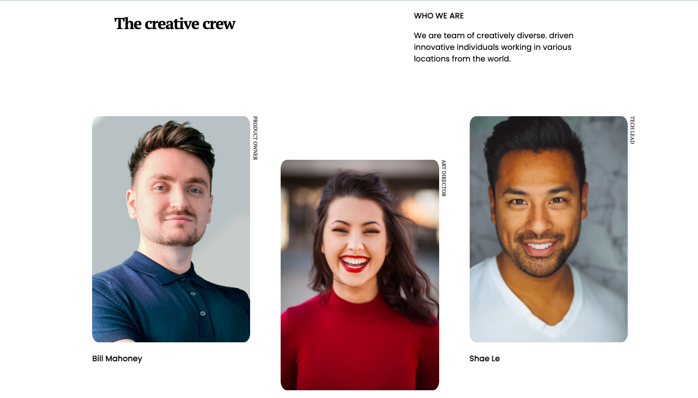

<!-- Please update value in the {}  -->

<h1 align="center">404-Page-Not-Found</h1>

   Solution for a challenge from  <a href="http://devchallenges.io" target="_blank">Devchallenges.io</a>.

  <h3>
    <a href="https://{your-demo-link.your-domain}">
      Demo
    </a>
     | 
    <a href="https://{your-url-to-the-solution}">
      Solution
    </a>
     | 
    <a href="https://devchallenges.io/challenges/wBunSb7FPrIepJZAg0sY">
      Challenge
    </a>
  </h3>

<!-- TABLE OF CONTENTS -->

## Table of Contents

- [Overview](#overview)
  - [Built With](#built-with)
- [Features](#features)
- [Contact](#contact)
- [Acknowledgements](#acknowledgements)

<!-- OVERVIEW -->

## Overview

- See the demo : [Demo](https://compassionate-jones-233d26.netlify.app/)

- That's my second challenge of the Responsive Web Developper module. I really enjoyed building this team page and find the best way to make it responsive with the knowledge I have with CSS and HTML, I am looking forward to improve my skill with others challenges :).

- I used CSS grid to master the page but I think I could improve it just using CSS flexbox. Also, I heard about "mobile first" developement and I will try for futur projects. 

### Built With

<!-- This section should list any major frameworks that you built your project using. Here are a few examples.-->

- HTML
- CSS

## Features

<!-- List the features of your application or follow the template. Don't share the figma file here :) -->

This site was created as a submission to a [DevChallenges](https://devchallenges.io/challenges) challenge. The [challenge](https://devchallenges.io/challenges/wBunSb7FPrIepJZAg0sY) was to build an application to complete the given user stories.

## Acknowledgements

<!-- This section should list any articles or add-ons/plugins that helps you to complete the project. This is optional but it will help you in the future. For exmpale -->

- [Steps to replicate a design with only HTML and CSS](https://devchallenges-blogs.web.app/how-to-replicate-design/)

## Contact

- GitHub [@Sarahhabbi](https://github.com/Sarahhabbi)
- Linkedin [Sarah Habbi](https://www.linkedin.com/in/sarah-habbi-1a2ba81a4/)
